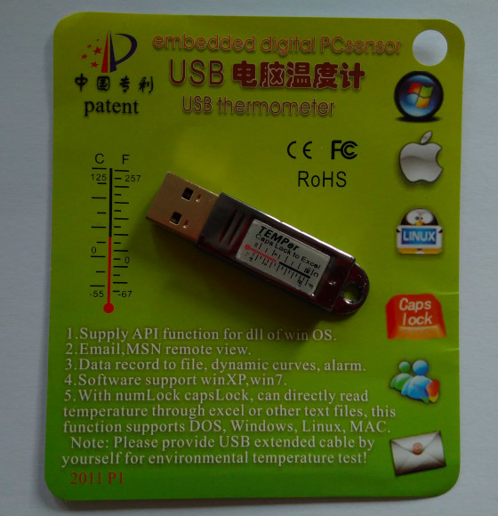

# Read the temperature of a TEMPer device with ID 413d:2107
There are many libraries (C, Python) out there for reading the TEMPer
family of thermometer and hygrometer devices.

Since I own only one device with USB ID `413d:2107` and wanted just simple JSON output, I
wrote yet another program to read from this kind of USB device.

## Dependencies
It uses the [HIDAPI](https://github.com/signal11/hidapi) library as dependency.

On Debian (based):

    sudo apt install libhidapi-hidraw0
	
On Arch:

    sudo pacman -S hidapi

## Device

### `dmesg`

Example `dmesg` output:

    [35813.492854] usb 2-1.3: new full-speed USB device number 25 using ehci-pci
    [35813.591045] usb 2-1.3: New USB device found, idVendor=413d, idProduct=2107, bcdDevice= 0.00
    [35813.591053] usb 2-1.3: New USB device strings: Mfr=0, Product=0, SerialNumber=0
    [35813.603164] input: HID 413d:2107 as /devices/pci0000:00/0000:00:1d.0/usb2/2-1/2-1.3/2-1.3:1.0/0003:413D:2107.0027/input/input39
    [35813.660537] hid-generic 0003:413D:2107.0027: input,hidraw0: USB HID v1.11 Keyboard [HID 413d:2107] on usb-0000:00:1d.0-1.3/input0
    [35813.662589] hid-generic 0003:413D:2107.0028: hiddev1,hidraw1: USB HID v1.10 Device [HID 413d:2107] on usb-0000:00:1d.0-1.3/input1

### `lsusb` 

Example `lsusb -d 413d:2107` output:

    Bus 002 Device 025: ID 413d:2107

### Photo

Photo of my TEMPer device:

## License
The program is licensed under [GPLv3](https://www.gnu.org/licenses/gpl-3.0.txt) ([local copy](LICENSE-GPL-3.0.txt)).
